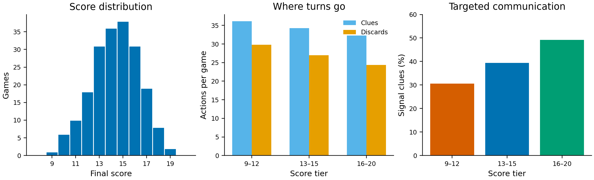

# Error analysis

This analysis covers the 200 primary games (15,015 decisions). It separates
safety failures from strategic inefficiency and reports denominators for every
rate.



## What JEV does well

- **Safety:** 0 of 200 games lost a life.
- **Safe-play compliance:** 2,873 decisions had a guaranteed-safe play; the
  policy selected one on all 2,873 occasions.
- **Scoring:** 2,873 successful plays produced the 14.37/25 mean score.

The safety gate is doing substantial work here: these numbers measure a hybrid
of JEV scoring and deterministic game-state constraints, rather than an
unconstrained language-model policy.

## Where score is lost

When no guaranteed play is available, the policy made 6,800 clue decisions and
5,342 discard decisions. Of the clues, 2,756/6,800 (**40.5%**) created at
least one guaranteed-play option for the recipient's next turn. The remaining
4,044 clues (**59.5%**) supplied information without an immediate guaranteed
play.

| Score tier | Games | Mean score | Clues/game | Discards/game | Signal clues |
|---|---:|---:|---:|---:|---:|
| 9–12 | 35 | 11.29 | 36.14 | 29.80 | 30.6% |
| 13–15 | 105 | 14.07 | 34.26 | 27.01 | 39.3% |
| 16–20 | 60 | 16.68 | 32.30 | 24.38 | 49.2% |

Higher-scoring games spend fewer turns on clues and discards and use a larger
share of clues to create an immediate play opportunity. This is descriptive
evidence of a throughput and communication-targeting bottleneck; it does not
prove that forcing more signal clues will improve score.

## JEV decision uncertainty

The structured response's mean harmful-action probability was 5.6% for
discard selections, 2.4% for clues, and 3.1% for plays. These probabilities did
not translate into life losses because unsafe plays were removed before the
JEV request. The mean gap between JEV's top and second-ranked eligible action
was 0.107 for discards, 0.315 for clues, and 0.084 for plays, indicating that
many play and discard choices were close calls for the model.

## Policy ablation

Two matched sensitivity comparisons are reported in
[`RESULTS.md`](RESULTS.md). Raising the discard threshold from 0.10 to 0.20
changed the policy by **+0.10 points** (95% CI −0.50 to +0.70). Adding a 0.1
risk penalty changed it by **+0.12 points** (95% CI −0.42 to +0.66). Neither
effect is distinguishable from zero.

## Reproduce

The report and figure are generated from the retained local JSONL artifacts:

```sh
python3 scripts/analyze_error.py
```

The generated JSON contains the complete per-game tier table and action-level
denominators. Raw JSONL transcripts are ignored by Git because they contain
full prompts; the committed manifests identify each source and result hash.
